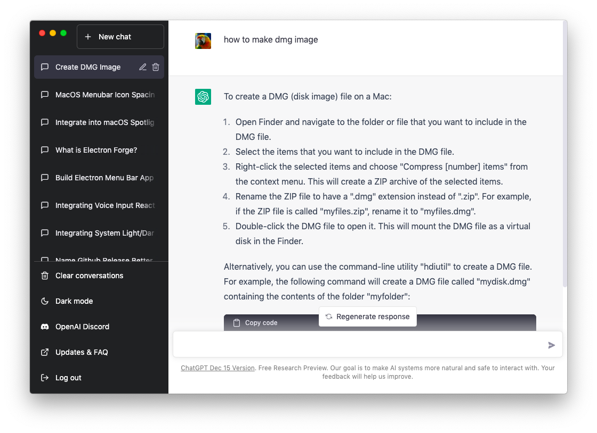
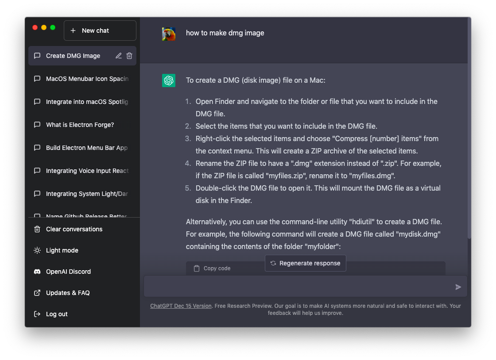

# ChatGPT Nativefier

Desktop electron app generated using Nativefier.
Fixed Google Login
<div align="center">





</div>

Install nativefier:

```sh
npm install -g nativefier
# or
yarn global add nativefier
```

Clone the repository:

```
git clone https://github.com/nezort11/nativefier.git
```

Run the command to create a macOS app:

```
./build.sh
```

The script contains the following invocation of `nativefier`:

```
nativefier \
  https://chat.openai.com/chat \
  --name 'ChatGPT' \
  --icon ./chatgpt.icns \
  --tray \
  --tray-icon ./chatgpt.icns \
  --background-color '#ffffff' \
  --darwin-dark-mode-support true \
  --title-bar-style hiddenInset \
  --inject ./chatgpt.css \
  --inject ./chatgpt.js \
  --min-width 320 \
  --min-height 568 \
  --browserwindow-options '{ "trafficLightPosition": { "x": 16, "y": 16 } }' \
  --disable-old-build-warning-yesiknowitisinsecure
```

Alternatively, you can create the application with a simplified command:

```sh
nativefier \
  --name "ChatGPT" \
  --tray \
  --tray-icon /path/to/chatgpt-icon.png \
  --single-instance \
  https://chat.openai.com \
  ~/Applications
```

## Install from a build

Running `./build.sh` will generate a folder such as `ChatGPT-darwin-x64` (or
the equivalent for your platform). Move the generated app from this folder to
your `Applications` directory to install it:

```sh
mv ChatGPT-darwin-x64/ChatGPT.app /Applications
```

## Custom icons

You can provide your own icon by passing the `--icon` and `--tray-icon` options
to the build script or by replacing the included `chatgpt.icns` file with your
own. Icons should be in `.icns` format on macOS or `.png` on other platforms.

## Running the app

After installing or building, start the application from your Applications
folder, or run it directly from the build output:

```sh
open /Applications/ChatGPT.app
```
